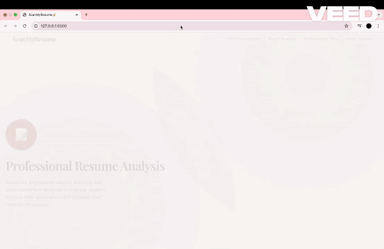
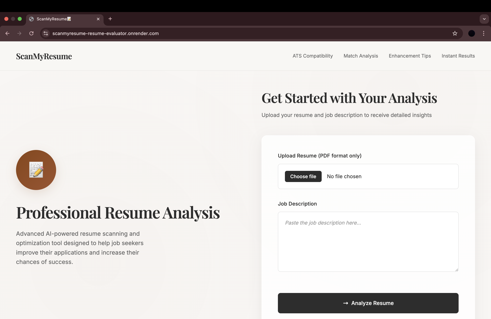
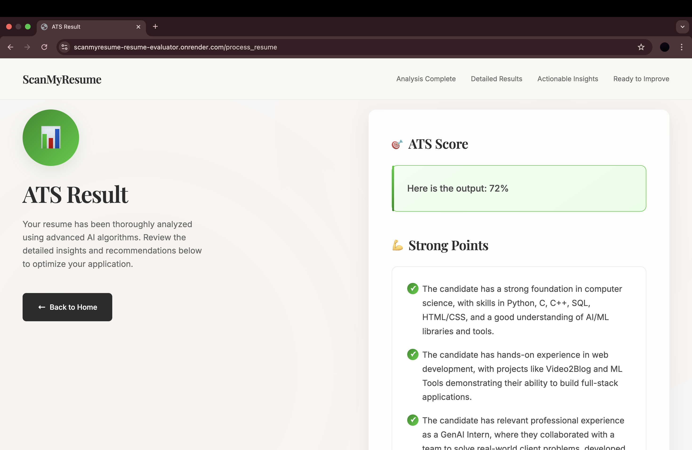

# 📄ScanMyResume

ScanMyResume is an AI-powered resume screening tool that uses the LLaMA language model to analyze a candidate's resume against a given job description. It provides an ATS score indicating how well the resume aligns with the job role, highlights the strong points that match the job requirements, and offers personalized suggestions to improve the resume's effectiveness and relevance.


## Demo




## Screenshots




## Features

📄 Resume Parsing – Extracts and reads resume content (PDF or text format).

🧠 AI-Powered Matching – Uses LLaMA model to compare resume with job description.

📊 ATS Score Generation – Calculates how well the resume aligns with ATS criteria.

✅ Strong Points Identification – Highlights matching skills, experiences, and keywords.

📝 Improvement Suggestions – Provides actionable feedback to optimize resume content.

💼 Job Description Analyzer – Understands role requirements to enhance evaluation accuracy.

## Installation

Install my-project with npm

```bash
  pip install requirements.txt
```
    
## Tech Stack

Client: HTML, CSS, 

Server: Python, Flask

AI Model: LLaMA 70b model

Libraries: PyPDF2, spaCy, scikit-learn, NumPy, Pandas